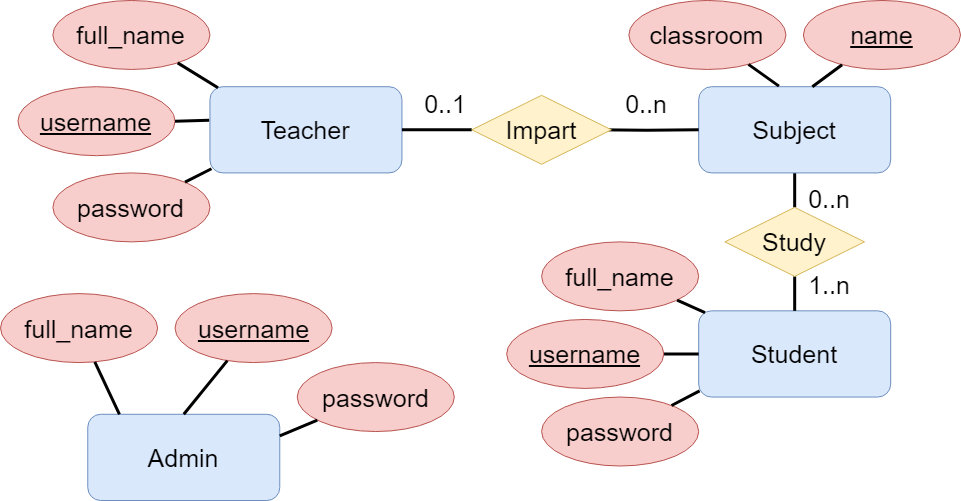

# Subject Manager

This project consists of a web application that allows administrator
users to manage teachers, students and subjects.

This project is uploaded in [this repository](https://github.com/josecamporivas/subject-manager)

## Database schema
The database schema is simple and consists of four models: teachers, students, subjects and admins.

Following the current database schema:



A simple explanation of the database schema:
- A teacher can teach one subject.
- A student can enroll in multiple subjects.
- A subject can be taught by multiple teachers and have multiple students enrolled.
- The administrator can manage the teachers, students and subjects.
- The administrator is the only one who can access the application.

## Features
- **Login and register**: The application has a login and register page for the admins.
- **CRUD operations**: The application allows the admin to create, read, update and delete teachers, students and subjects.
- **Validation**: The application validates the data entered by the admin.

## Requirements
- **Python 3.12** or higher
- **Redis**

## Installation
First, you need to clone the repository and install the requirements:
```bash
git clone https://github.com/josecamporivas/subject-manager

cd subject-manager

pip install -r requirements.txt
```

## Usage
For usage purposes, you need to have [Redis](https://redis.io/) running on your computer.

[OPTIONAL] Once you have Redis running, you can set up initial data for the database by running the following command:
```bash
python set_up_data.py
```

After that, you can run the application by running the following command:
```bash
python main.py
```

Now, go to your browser and search http://localhost:5000 to access the application.

By default, the set-up data before has one user:
- Username: **admin**
- Password: **admin**

You can log in with these credentials or create your own user un the register page.
